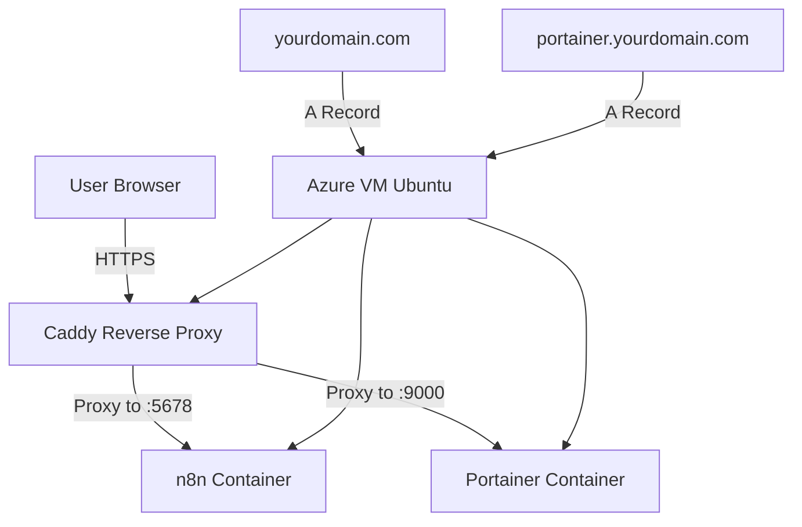

# Hosting n8n on Microsoft Azure Using Docker & Caddy

This guide provides a complete, professional walkthrough of deploying **n8n** on a Microsoft Azure Virtual Machine using **Docker**, **Docker Compose**, and **Caddy** as a reverse proxy with HTTPS. It includes all steps from VM creation to accessing the n8n editor through a domain name, as well as real issues encountered and how they were resolved.

---

## Table of Contents

1. [Overview](#overview)
2. [Prerequisites](#prerequisites)
3. [Step 1 — Create Azure Virtual Machine](#step-1--create-azure-virtual-machine)
4. [Step 2 — Connect to the VM](#step-2--connect-to-the-vm)
5. [Step 3 — Install Dependencies](#step-3--install-dependencies)
6. [Step 4 — Create Configuration Files](#step-4--create-configuration-files)
7. [Step 5 — Set Up n8n With Docker Compose](#step-5--set-up-n8n-with-docker-compose)
8. [Step 6 — Set Up Caddy Reverse Proxy with Portainer](#step-6--set-up-caddy-reverse-proxy-with-portainer)
9. [Step 7 — Configure DNS](#step-7--configure-dns)
10. [Step 8 — Start All Services](#step-8--start-all-services)
11. [Step 9 — Access Your Services](#step-9--access-your-services)
12. [Troubleshooting & Errors Encountered](#troubleshooting--errors-encountered)
13. [Security Recommendations](#security-recommendations)
14. [Credits](#credits)

---

## Overview

You will:

* Deploy an Ubuntu VM in Azure
* Install Docker & Docker Compose
* Run **n8n** in a Docker container (auto-updates via Watchtower)
* Run **Portainer** for easy container management (auto-updates via Watchtower)
* Run **Watchtower** for automatic container image updates (daily checks)
* Use **Caddy** to provide automatic HTTPS via Let's Encrypt
* Access your n8n instance via **[https://yourdomain.com](https://yourdomain.com)**
* Access Portainer dashboard via **[https://portainer.yourdomain.com](https://portainer.yourdomain.com)**

---

## Prerequisites

* An Azure account
* A domain name (any registrar)
* Basic Linux & SSH familiarity

---

## Step 1 — Create Azure Virtual Machine

1. Log in to **Azure Portal**.
2. Create a **Virtual Machine**:

   * Image: **Ubuntu 22.04 LTS**
   * Size: Standard B1s or higher
   * Authentication: SSH key recommended
3. Networking:

   * Open ports: **22**, **80**, **443**
4. Create and launch the VM.

---

## Step 2 — Connect to the VM

Use SSH from your terminal:

```bash
ssh azureuser@YOUR_VM_PUBLIC_IP
```

Update system:

```bash
sudo apt update && sudo apt upgrade -y
```

---

## Step 3 — Install Dependencies

### Install Docker

```bash
curl -fsSL https://get.docker.com | sudo bash
sudo usermod -aG docker $USER
```

Reboot or re-login:

```bash
exit
```

Then SSH back in to apply the new group permissions.

### Install Docker Compose

```bash
sudo apt install docker-compose-plugin -y
```

Verify installation:

```bash
docker compose version
```

---

## Step 4 — Create Configuration Files

### Create the project directory

Navigate to the home directory and create the n8n project folder:

```bash
cd ~
mkdir -p n8n
cd n8n
```

Verify you're in the correct directory:

```bash
pwd
```

You should see: `/home/azureuser/n8n`

### Create the `.env` Configuration File

Create a new `.env` file with your custom settings:

```bash
nano .env
```

Paste the .env

**⚠️ IMPORTANT:**
- Replace `yourdomain.com` with your actual domain name
- Replace password placeholders with strong, unique passwords
- Save the file by pressing `Ctrl+X`, then `Y`, then `Enter`

### Verify the `.env` file was created

```bash
cat .env
```

You should see the environment variables you just created.

---

## Step 5 — Set Up n8n With Docker Compose

Create the `docker-compose.yml` file with all services:

```bash
nano docker-compose.yml
```

Paste the docker-compose.yml file contents

Save the file: Press `Ctrl+X`, then `Y`, then `Enter`.

Verify all files exist:

```bash
ls -la
```

You should see:
- `.env`
- `docker-compose.yml`
- `Caddyfile`

---

### ⚡ About Watchtower

**Watchtower** automatically checks for new container image updates **every 7 days (once a week)** and applies them:

- **n8n**: Auto-updates to the latest version
- **Portainer**: Auto-updates to the latest version
- **Caddy**: Does NOT auto-update (you choose when to update)

To **disable auto-updates** for a service, remove its `watchtower.enable=true` label.

To **manually trigger an update** without waiting 7 days:

```bash
docker exec watchtower /watchtower --run-once
```

---

## Step 6 — Set Up Caddy Reverse Proxy with Portainer

Create the `Caddyfile` for reverse proxy configuration:

```bash
nano Caddyfile
```

Paste the Caddyfile contents

**⚠️ IMPORTANT:** Replace `yourdomain.com` with your actual domain in BOTH places (n8n and portainer).

Save the file: Press `Ctrl+X`, then `Y`, then `Enter`.

---

## Step 7 — Configure DNS

You need to add DNS records pointing to your Azure VM's public IP address.

### Get your VM's public IP

```bash
curl -s https://api.ipify.org
```

Note this IP address.

### Add DNS Records

Go to your domain registrar (Namecheap, GoDaddy, Cloudflare, etc.) and add the following records:

**A Record for n8n:**

| Type | Host | Value             | TTL  |
| ---- | ---- | ----------------- | ---- |
| A    | @    | YOUR_VM_PUBLIC_IP | Auto |

**A Record for Portainer:**

| Type | Host      | Value             | TTL  |
| ---- | --------- | ----------------- | ---- |
| A    | portainer | YOUR_VM_PUBLIC_IP | Auto |

**Wait 5–15 minutes** for DNS propagation to complete. You can check DNS status at [whatsmydns.net](https://whatsmydns.net).

---

## Step 8 — Start All Services

Navigate back to your n8n folder:

```bash
cd ~/n8n
```

Verify all files are in place:

```bash
ls -la
```

You should see:
- `.env`
- `docker-compose.yml`
- `Caddyfile`

### Start the Docker containers

```bash
docker compose up -d
```

This will download and start all three services:
- **n8n** (workflow automation)
- **Caddy** (reverse proxy with HTTPS)
- **Portainer** (container management)

### Verify all containers are running

```bash
docker ps
```

You should see three containers listed:
- `n8n`
- `caddy`
- `portainer`

All should have status `Up`.

### Check container logs (useful for troubleshooting)

```bash
# View n8n logs
docker logs n8n

# View Caddy logs
docker logs caddy

# View Portainer logs
docker logs portainer
```

---

## Step 9 — Access Your Services

### Access n8n

Open your browser and visit:

```
https://yourdomain.com
```

You should see the n8n login page.

**Login credentials (from `.env` file):**
- Username: `admin`
- Password: (the password you set in `.env`)

### Access Portainer

Open your browser and visit:

```
https://portainer.yourdomain.com
```

You should see the Portainer setup page.

**First-time Portainer setup:**
1. Create an admin user and password
2. Click "Create User"
3. Select "Connect local Docker environment"
4. Click "Connect"

Now you can manage all your Docker containers from the Portainer dashboard!

### Troubleshoot If Services Don't Load

If you get an error, wait 1-2 minutes for DNS propagation and try again.

If you still get errors, check:

```bash
# Check if all containers are healthy
docker ps -a

# Check Caddy logs for SSL certificate issues
docker logs caddy | tail -20

# Restart all services
docker compose restart
```

---

## Troubleshooting & Errors Encountered

### ❗ Error: Port 80 Already in Use

When checking:

```bash
sudo lsof -i :80
```

Output:

```
docker-pr ... TCP *:http (LISTEN)
```

**Meaning**: A Docker container was already using port 80.

**Fix**:

* Identify container: `docker ps`
* Stop it: `docker stop <ID>`
* Free the port, then restart Caddy.

### ❗ Caddy Not Issuing SSL Certificate

Causes:

* DNS not propagated
* Port 80 blocked

Fix:

* Ensure Azure Network Security Group allows ports 80 & 443
* Wait up to 10 mins for DNS changes

### ❗ n8n Not Loading After Proxy Setup

Cause:

* Missing environment variables (HOST, PROTOCOL, WEBHOOK_URL)

Fix:
Add proper environment values inside Docker Compose.

---

## Security Recommendations

* Use a firewall (UFW) allowing only 22, 80, 443
* Enable Fail2Ban for SSH
* Use Azure-managed backups for persistence
* Store secrets using n8n credentials, not environment variables

---

## Credits

This deployment guide is based on real debugging done while hosting n8n via Docker and Caddy on Azure, including port conflicts, DNS propagation delays, and SSL issues.

---

**This document is ready for use in your GitHub repository.**

---

# 📌 TL;DR (Quick Summary)

* Create Azure VM → Install Docker & Docker Compose → Create `.env` config → Use **single docker-compose.yml** with n8n + Portainer + Caddy + **Watchtower** → Configure DNS (both yourdomain.com and portainer.yourdomain.com) → Start all containers → Enjoy secure HTTPS hosting with automatic updates!
* **Watchtower automatically updates n8n and Portainer every 7 days (once a week)** (you can disable per-service if needed, or trigger manual updates anytime)
* Common issues include Docker conflicts, port 80 already in use, DNS not propagated, or incorrect domain names in Caddyfile

---

# 📊 System Architecture (Diagram)



---

# 🚀 Quick Deploy Script (Simplifies Setup)

```bash
#!/bin/bash
# Quick Deploy Script for n8n + Portainer + Caddy

# Step 1: Update system packages
sudo apt update && sudo apt upgrade -y

# Step 2: Install Docker
curl -fsSL https://get.docker.com -o get-docker.sh
sudo sh get-docker.sh
sudo usermod -aG docker $USER

# Step 3: Install Docker Compose Plugin
sudo apt install docker-compose-plugin -y

# Step 4: Create project directory
mkdir -p ~/n8n
cd ~/n8n

# Step 5: Create .env file (customize values!)
cat > .env << 'EOF'
N8N_HOST=yourdomain.com
N8N_PORT=5678
N8N_PROTOCOL=https
N8N_BASIC_AUTH_ACTIVE=true
N8N_BASIC_AUTH_USER=admin
N8N_BASIC_AUTH_PASSWORD=YourStrongPassword123!
WEBHOOK_URL=https://yourdomain.com/
GENERIC_TIMEZONE=Africa/Nairobi
NODE_ENV=production
DB_TYPE=sqlite
DB_SQLITE_VACUUM_ON_STARTUP=true
N8N_TRUSTED_PROXIES=loopback,linklocal,uniquelocal
N8N_DEFAULT_BINARY_DATA_MODE=filesystem
N8N_COMMUNITY_PACKAGES_ALLOW_TOOL_USAGE=true
PORTAINER_HOST=portainer.yourdomain.com
PORTAINER_PORT=9000
PORTAINER_ADMIN_USER=admin
PORTAINER_ADMIN_PASSWORD=YourStrongPassword123!
CADDY_PORT_HTTP=80
CADDY_PORT_HTTPS=443
EOF

# Step 6: Download docker-compose.yml
# (Copy the docker-compose.yml content from the guide)

# Step 7: Download Caddyfile
# (Copy the Caddyfile content from the guide)

# Step 8: Start all services
docker compose up -d

# Step 9: Check status
docker ps

echo "✅ Deployment complete! Access services at:"
echo "🔗 n8n: https://yourdomain.com"
echo "🔗 Portainer: https://portainer.yourdomain.com"
```

**Note:** Replace `yourdomain.com` and passwords in the script before running!


---

# 🩺 Troubleshooting Table

| Issue                                      | Cause                              | Fix                                                                                |
| ------------------------------------------ | ---------------------------------- | ---------------------------------------------------------------------------------- |
| Port 80 or 443 already in use              | Old Caddy/container still running  | `docker stop caddy && docker rm caddy`, then `docker compose up -d`                |
| n8n not loading                            | n8n container crashed              | Check logs: `docker logs n8n`                                                     |
| Portainer not loading                      | Portainer container crashed        | Check logs: `docker logs portainer`                                               |
| Caddy can't get SSL certificate            | DNS not propagated or port 80 blocked | Wait 5-15 min, check Azure NSG allows ports 80 & 443                             |
| "Connection refused" at yourdomain.com     | DNS not updated                    | Check at [whatsmydns.net](https://whatsmydns.net) that A records are set          |
| "Connection refused" at portainer.yourdomain.com | Missing Portainer A record   | Add `portainer.yourdomain.com` A record pointing to VM IP                          |
| Docker containers won't start              | Port conflicts                     | Run `docker compose down` then `docker compose up -d`                              |
| "docker: command not found"                | Docker not installed properly      | Re-run: `curl -fsSL https://get.docker.com \| sudo bash`                           |
| .env file not being read                   | File permissions issue             | Run: `chmod 644 .env`                                                              |
| Containers keep restarting                 | Configuration error in .env        | Check logs: `docker logs <container_name>` to see specific errors                 |
| Watchtower not updating n8n/Portainer      | Labels missing or disabled         | Verify `watchtower.enable=true` labels in docker-compose.yml                      |
| Want to disable auto-updates               | Watchtower enabled globally        | Remove `watchtower.enable=true` label from service in docker-compose.yml          |
| Update containers immediately (don't wait 7 days) | Watchtower on weekly schedule | Run: `docker exec watchtower /watchtower --run-once`                              |

---

## Portainer Quick Tips

Once logged into Portainer:

1. **View Container Stats**: Containers → Select container → Stats tab
2. **View Container Logs**: Containers → Select container → Logs tab
3. **Restart a Service**: Containers → Select container → Restart button
4. **Update Container Image**: Containers → Select container → Recreate button
5. **Monitor System Health**: Dashboard tab shows CPU, memory, and running container count

---

## Watchtower Management

### Check Watchtower Logs

```bash
docker logs watchtower
```

You'll see update checks every 24 hours and any updates that were applied.

### Manually Trigger Update Check

```bash
docker exec watchtower /watchtower --run-once
```

### Disable Auto-updates for a Service

### Change Update Check Interval

Edit `docker-compose.yml` and modify `WATCHTOWER_POLL_INTERVAL`:

```yaml
- WATCHTOWER_POLL_INTERVAL=604800  # 7 days/1 week (604800 seconds) - current setting
- WATCHTOWER_POLL_INTERVAL=86400   # 1 day (86400 seconds)
- WATCHTOWER_POLL_INTERVAL=43200   # 12 hours (43200 seconds)
```

---

## Upgrading Services

### Automatic Updates (via Watchtower)

Watchtower automatically updates **n8n** and **Portainer** images every 7 days (once a week). Old images are cleaned up to save disk space.

You don't need to do anything—updates happen automatically!

### Manual Update (Force Immediate Update)

To update immediately without waiting 7 days:

```bash
docker exec watchtower /watchtower --run-once
```

### Manual Update of Caddy (Not Auto-Updated)

Caddy does **not** auto-update. To manually update Caddy:

```bash
cd ~/n8n
docker pull caddy:latest
docker compose up -d
```

### View Update History

Check Watchtower logs to see what was updated:

```bash
docker logs watchtower | tail -50
```

---

# 📝 License

```
MIT License
```

---

# 👥 Credits

* Author: BRUCE BOGE

* Hosting Stack: Docker, Caddy, Watchtower, n8n, Azure VM
